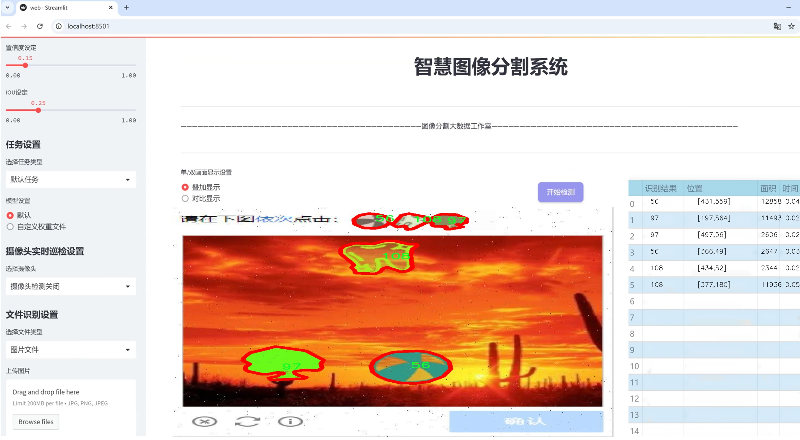
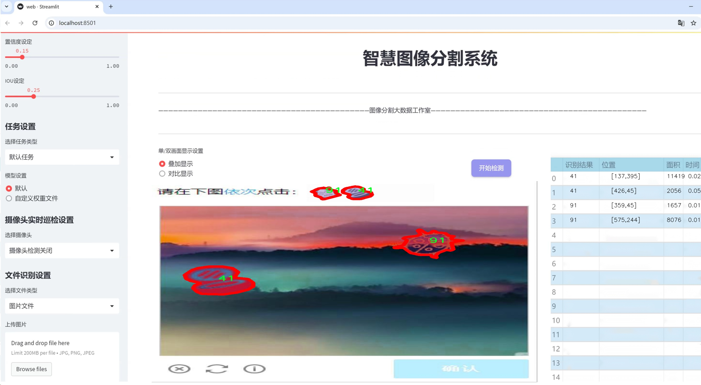
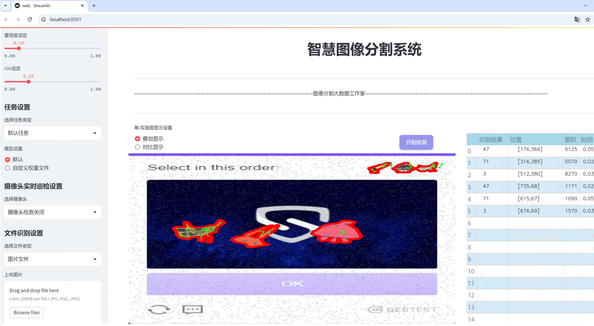
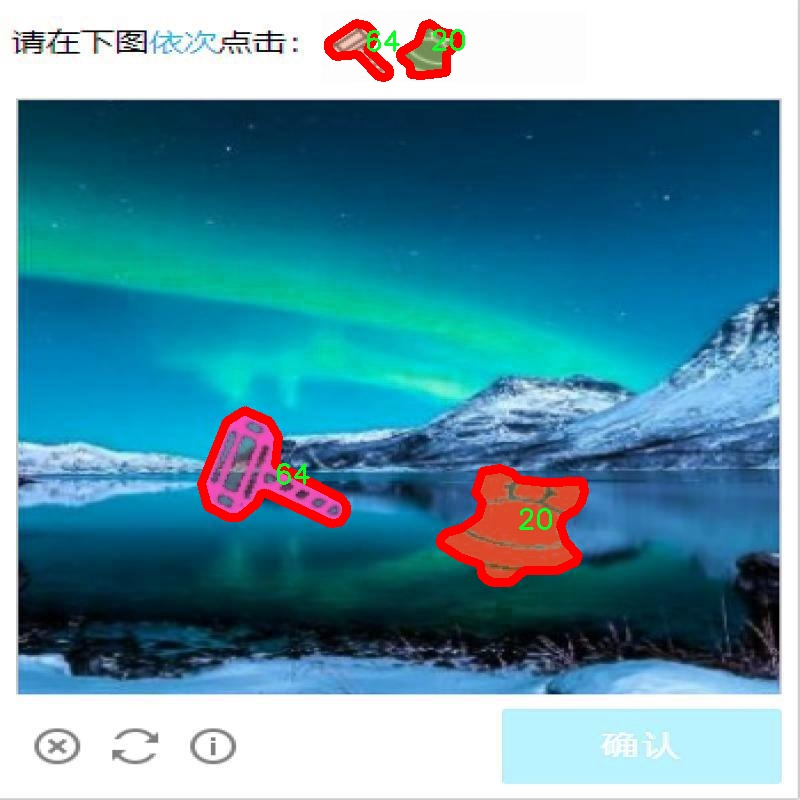
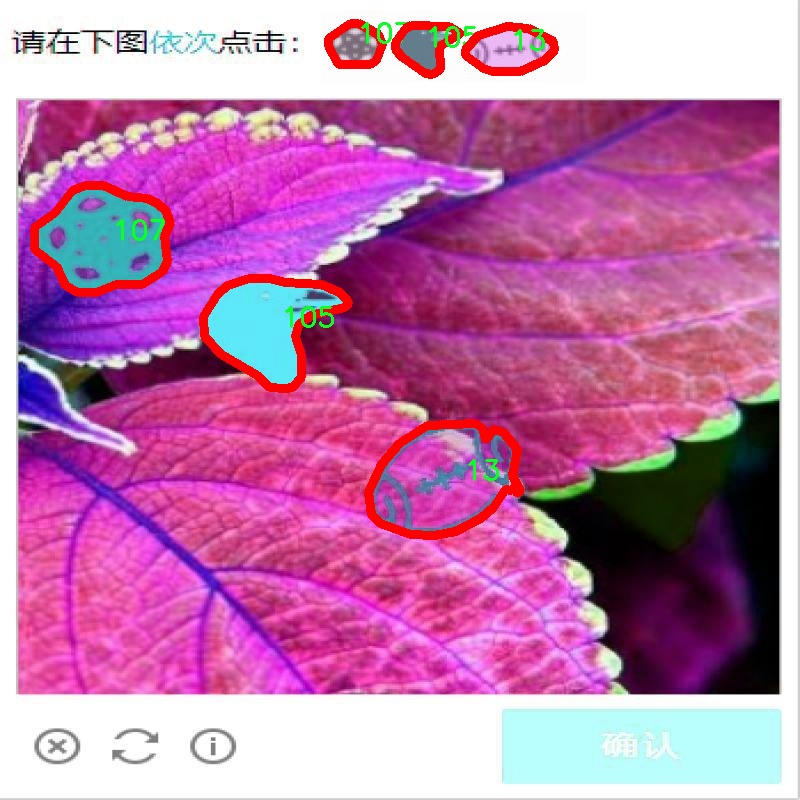
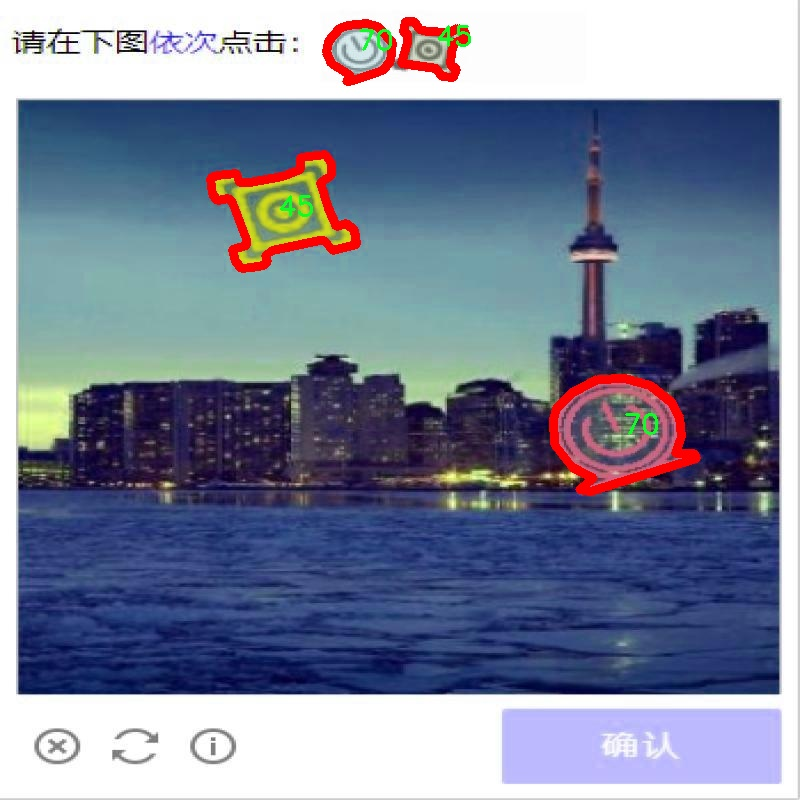
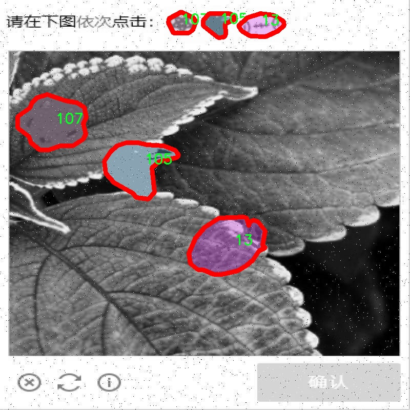
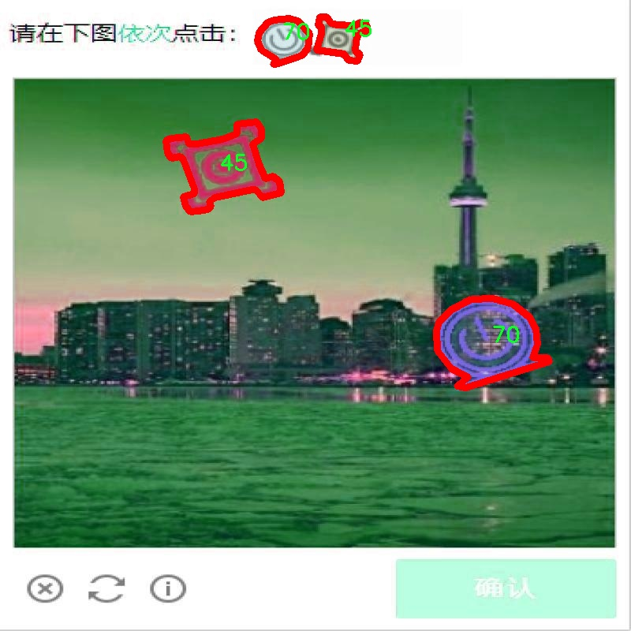

# 验证码图像分割系统源码＆数据集分享
 [yolov8-seg-p2＆yolov8-seg-C2f-DCNV2等50+全套改进创新点发刊_一键训练教程_Web前端展示]

### 1.研究背景与意义

项目参考[AAAI Association for the Advancement of Artificial Intelligence](https://gitee.com/YOLOv8_YOLOv11_Segmentation_Studio/projects)

项目来源[AACV Association for the Advancement of Computer Vision](https://kdocs.cn/l/cszuIiCKVNis)

研究背景与意义

随着信息技术的迅猛发展，验证码作为一种重要的安全机制，广泛应用于网络服务中，以防止自动化程序的恶意攻击。然而，传统的验证码往往设计得较为复杂，旨在增加人类用户的识别难度，同时也给机器识别带来了挑战。近年来，深度学习技术的进步为验证码的自动识别提供了新的解决方案，尤其是基于卷积神经网络（CNN）的目标检测和图像分割技术的快速发展，使得验证码图像的处理和分析成为可能。

YOLO（You Only Look Once）系列模型因其高效的实时目标检测能力而受到广泛关注。YOLOv8作为该系列的最新版本，具备更强的特征提取能力和更快的推理速度，适合处理复杂的验证码图像。通过对YOLOv8的改进，结合实例分割技术，可以实现对验证码中各个字符和图形的精确分割，从而提高识别的准确性和效率。本文旨在基于改进的YOLOv8模型，构建一个高效的验证码图像分割系统，以应对日益复杂的验证码设计。

在本研究中，我们使用的数据集包含1500张验证码图像，涵盖了110个类别，提供了丰富的样本数据。这些验证码图像的多样性和复杂性，为模型的训练和验证提供了良好的基础。通过对这些图像进行实例分割，我们不仅可以提取出验证码中的各个字符，还可以分析其相互之间的关系，从而为后续的字符识别提供支持。该数据集的设计考虑了不同字符的形状、颜色和排列方式，使得模型在训练过程中能够学习到更为全面的特征。

本研究的意义在于，首先，提升验证码的自动识别能力，将为网络安全领域提供更为有效的解决方案。通过实现高效的验证码图像分割，能够有效降低人工识别的工作量，提高系统的安全性和用户体验。其次，改进YOLOv8模型的研究将为深度学习在图像处理领域的应用提供新的思路和方法，推动相关技术的发展。此外，本研究还将为验证码的设计提供反馈，促使验证码的设计者在安全性与用户体验之间找到更好的平衡。

综上所述，基于改进YOLOv8的验证码图像分割系统的研究，不仅具有重要的理论价值，还有着广泛的实际应用前景。通过深入探索验证码图像的特征和规律，能够为网络安全技术的发展提供新的动力，同时也为后续的研究提供了丰富的实验数据和理论基础。

### 2.图片演示







##### 注意：由于此博客编辑较早，上面“2.图片演示”和“3.视频演示”展示的系统图片或者视频可能为老版本，新版本在老版本的基础上升级如下：（实际效果以升级的新版本为准）

  （1）适配了YOLOV8的“目标检测”模型和“实例分割”模型，通过加载相应的权重（.pt）文件即可自适应加载模型。

  （2）支持“图片识别”、“视频识别”、“摄像头实时识别”三种识别模式。

  （3）支持“图片识别”、“视频识别”、“摄像头实时识别”三种识别结果保存导出，解决手动导出（容易卡顿出现爆内存）存在的问题，识别完自动保存结果并导出到tempDir中。

  （4）支持Web前端系统中的标题、背景图等自定义修改，后面提供修改教程。

  另外本项目提供训练的数据集和训练教程,暂不提供权重文件（best.pt）,需要您按照教程进行训练后实现图片演示和Web前端界面演示的效果。

### 3.视频演示

[3.1 视频演示](https://www.bilibili.com/video/BV1dqxQefE9H/)

### 4.数据集信息展示

##### 4.1 本项目数据集详细数据（类别数＆类别名）

nc: 109
names: ['1', '10', '100', '101', '102', '103', '104', '105', '106', '107', '108', '11', '110', '12', '13', '14', '15', '16', '17', '18', '19', '2', '20', '21', '22', '23', '24', '25', '26', '27', '28', '29', '3', '30', '31', '32', '33', '34', '35', '36', '37', '38', '39', '4', '40', '41', '42', '43', '44', '45', '46', '47', '48', '49', '5', '50', '51', '52', '53', '54', '55', '56', '57', '58', '59', '6', '60', '61', '62', '63', '64', '65', '66', '67', '68', '69', '7', '70', '71', '72', '73', '74', '75', '76', '77', '78', '79', '8', '80', '81', '82', '83', '84', '85', '86', '87', '88', '89', '9', '90', '91', '92', '93', '94', '95', '96', '97', '98', '99']


##### 4.2 本项目数据集信息介绍

数据集信息展示

在本研究中，我们使用的数据集名为“data_is”，该数据集专门用于训练和改进YOLOv8-seg的验证码图像分割系统。验证码作为一种常见的安全机制，广泛应用于各种在线服务中，以防止自动化程序的攻击。随着技术的进步，验证码的复杂性不断增加，因此，开发高效的图像分割系统以准确识别和解析验证码中的字符变得尤为重要。

“data_is”数据集包含109个类别，涵盖了从数字“0”到“9”以及更高的数字组合，具体类别包括：'1', '10', '100', '101', '102', '103', '104', '105', '106', '107', '108', '11', '110', '12', '13', '14', '15', '16', '17', '18', '19', '2', '20', '21', '22', '23', '24', '25', '26', '27', '28', '29', '3', '30', '31', '32', '33', '34', '35', '36', '37', '38', '39', '4', '40', '41', '42', '43', '44', '45', '46', '47', '48', '49', '5', '50', '51', '52', '53', '54', '55', '56', '57', '58', '59', '6', '60', '61', '62', '63', '64', '65', '66', '67', '68', '69', '7', '70', '71', '72', '73', '74', '75', '76', '77', '78', '79', '8', '80', '81', '82', '83', '84', '85', '86', '87', '88', '89', '9', '90', '91', '92', '93', '94', '95', '96', '97', '98', '99'。这些类别的设计旨在涵盖所有可能的验证码字符组合，使得模型在训练过程中能够学习到多样化的特征。

数据集的构建过程注重多样性和代表性，确保包含不同字体、颜色、背景和扭曲效果的验证码图像。这种多样性不仅提高了模型的鲁棒性，还增强了其在实际应用中的适应能力。每个类别的图像数量经过精心设计，以保证模型在训练时能够获得均衡的学习机会，避免因某些类别样本过少而导致的过拟合现象。

在数据集的标注过程中，采用了精确的图像分割技术，以确保每个字符的边界清晰可辨。这种高质量的标注为YOLOv8-seg模型提供了可靠的训练基础，使其能够在验证码识别任务中实现更高的准确率和更快的处理速度。此外，数据集还包含了多种噪声和干扰元素，模拟真实环境中的验证码挑战，以提高模型在面对复杂场景时的表现。

为了评估模型的性能，我们将数据集划分为训练集、验证集和测试集，确保每个子集都能代表整个数据集的特征分布。这种划分策略使得我们能够在训练过程中进行有效的超参数调优，并在测试阶段准确评估模型的泛化能力。

综上所述，“data_is”数据集为改进YOLOv8-seg的验证码图像分割系统提供了坚实的基础，凭借其丰富的类别和高质量的标注，旨在推动验证码识别技术的发展，为未来的安全防护措施提供更为有效的解决方案。











### 5.全套项目环境部署视频教程（零基础手把手教学）

[5.1 环境部署教程链接（零基础手把手教学）](https://www.bilibili.com/video/BV1jG4Ve4E9t/?vd_source=bc9aec86d164b67a7004b996143742dc)


[5.2 安装Python虚拟环境创建和依赖库安装视频教程链接（零基础手把手教学）](https://www.bilibili.com/video/BV1nA4VeYEze/?vd_source=bc9aec86d164b67a7004b996143742dc)

### 6.手把手YOLOV8-seg训练视频教程（零基础小白有手就能学会）

[6.1 手把手YOLOV8-seg训练视频教程（零基础小白有手就能学会）](https://www.bilibili.com/video/BV1cA4VeYETe/?vd_source=bc9aec86d164b67a7004b996143742dc)


按照上面的训练视频教程链接加载项目提供的数据集，运行train.py即可开始训练



     Epoch   gpu_mem       box       obj       cls    labels  img_size
     1/200     0G   0.01576   0.01955  0.007536        22      1280: 100%|██████████| 849/849 [14:42<00:00,  1.04s/it]
               Class     Images     Labels          P          R     mAP@.5 mAP@.5:.95: 100%|██████████| 213/213 [01:14<00:00,  2.87it/s]
                 all       3395      17314      0.994      0.957      0.0957      0.0843

     Epoch   gpu_mem       box       obj       cls    labels  img_size
     2/200     0G   0.01578   0.01923  0.007006        22      1280: 100%|██████████| 849/849 [14:44<00:00,  1.04s/it]
               Class     Images     Labels          P          R     mAP@.5 mAP@.5:.95: 100%|██████████| 213/213 [01:12<00:00,  2.95it/s]
                 all       3395      17314      0.996      0.956      0.0957      0.0845

     Epoch   gpu_mem       box       obj       cls    labels  img_size
     3/200     0G   0.01561    0.0191  0.006895        27      1280: 100%|██████████| 849/849 [10:56<00:00,  1.29it/s]
               Class     Images     Labels          P          R     mAP@.5 mAP@.5:.95: 100%|███████   | 187/213 [00:52<00:00,  4.04it/s]
                 all       3395      17314      0.996      0.957      0.0957      0.0845


### 7.50+种全套YOLOV8-seg创新点代码加载调参视频教程（一键加载写好的改进模型的配置文件）

[7.1 50+种全套YOLOV8-seg创新点代码加载调参视频教程（一键加载写好的改进模型的配置文件）](https://www.bilibili.com/video/BV1Hw4VePEXv/?vd_source=bc9aec86d164b67a7004b996143742dc)

### 8.YOLOV8-seg图像分割算法原理

原始YOLOV8-seg算法原理

YOLOV8-seg算法是YOLO系列中的一项重要进展，专注于目标检测与分割任务。作为2023年由Ultralytics发布的最新模型，YOLOV8-seg不仅继承了前几代YOLO算法的优点，还在结构和功能上进行了创新与优化。该算法的设计理念旨在实现高效、快速且准确的目标检测，尤其是在复杂场景下的应用。

YOLOV8-seg算法的网络结构可以分为三个主要部分：输入端（Input）、主干网络（Backbone）和检测端（Head）。在这三个部分中，主干网络是特征提取的核心，负责从输入图像中提取有用的特征信息。YOLOV8-seg的主干网络采用了一系列卷积和反卷积层，结合了残差连接和瓶颈结构，以提高网络的性能并减小其复杂度。特别是，YOLOV8-seg引入了C2f模块，这一模块的设计灵感来源于YOLOv5中的C3模块和YOLOv7中的ELAN模块。C2f模块通过增加残差连接的数量，使得网络在保持轻量化的同时，能够获得更丰富的梯度信息，从而提升特征提取的效果。

在特征融合方面，YOLOV8-seg采用了PAN-FPN结构，通过多尺度特征融合技术，将来自主干网络不同阶段的特征图进行有效整合。这种融合方式不仅增强了模型对不同尺度目标的检测能力，还提高了模型在复杂场景下的鲁棒性。尤其是在处理小目标或被遮挡目标时，PAN-FPN结构的优势尤为明显。

YOLOV8-seg的检测端则采用了现代流行的解耦合头结构，将目标分类和检测任务分开处理。这种设计使得模型在进行目标检测时能够更加灵活高效。此外，YOLOV8-seg摒弃了传统的Anchor-Based方法，转而采用Anchor-Free的策略，这一变化使得模型在处理目标时更加简便，并减少了对超参数的依赖。

在训练过程中，YOLOV8-seg也引入了一些创新的数据增强策略。例如，在训练的最后10个epoch中，模型关闭了马赛克增强，并采用了动态的Task-Aligned Assigner样本分配策略。这种策略的引入，使得模型在训练过程中能够更好地适应不同的任务需求，从而提高了最终的检测性能。

损失函数的设计同样是YOLOV8-seg的一大亮点。该算法在分类损失方面采用了BCELoss，而在回归损失方面则结合了DFLLoss和CIoULoss。这种多元化的损失函数设计，旨在提升模型在目标检测和分割任务中的整体表现，使得YOLOV8-seg在精度和速度上都能达到新的高度。

YOLOV8-seg的应用场景非常广泛，尤其是在农业领域中的苹果采摘任务中展现出了良好的性能。通过其强大的视觉识别能力，YOLOV8-seg能够自动检测和定位苹果，为自动采摘机器人提供了可靠的支持。同时，为了提高采摘效率，研究者们还结合了蚁群算法进行路径规划，进一步提升了自动化作业的效率。

综上所述，YOLOV8-seg算法通过其独特的网络结构设计、创新的特征融合策略、灵活的检测头配置以及多样化的损失函数，成功地实现了目标检测与分割任务的高效处理。其在农业等实际应用中的成功案例，展示了YOLOV8-seg在未来目标检测领域的广阔前景和潜力。随着技术的不断进步，YOLOV8-seg无疑将为更多行业带来革命性的变化，推动智能化和自动化的进程。


### 9.系统功能展示（检测对象为举例，实际内容以本项目数据集为准）

图9.1.系统支持检测结果表格显示

  图9.2.系统支持置信度和IOU阈值手动调节

  图9.3.系统支持自定义加载权重文件best.pt(需要你通过步骤5中训练获得)

  图9.4.系统支持摄像头实时识别

  图9.5.系统支持图片识别

  图9.6.系统支持视频识别

  图9.7.系统支持识别结果文件自动保存

  图9.8.系统支持Excel导出检测结果数据


### 10.50+种全套YOLOV8-seg创新点原理讲解（非科班也可以轻松写刊发刊，V11版本正在科研待更新）

#### 10.1 由于篇幅限制，每个创新点的具体原理讲解就不一一展开，具体见下列网址中的创新点对应子项目的技术原理博客网址【Blog】：


[10.1 50+种全套YOLOV8-seg创新点原理讲解链接](https://gitee.com/qunmasj/good)

#### 10.2 部分改进模块原理讲解(完整的改进原理见上图和技术博客链接)
### 全维动态卷积ODConv
鉴于上述讨论，我们的ODConv引入了一种多维注意机制，该机制具有并行策略，用于学习卷积核在核空间的所有四个维度上的不同注意。图提供了CondConv、DyConv和ODConv的示意性比较。

ODConv的公式：根据等式1中的符号，ODConv可定义为


 将注意力标量分配给整个卷积核。图2示出了将这四种类型的关注乘以n个卷积核的过程。原则上，这四种类型的关注是相互补充的，并且以位置、信道、滤波器和核的顺序将它们逐步乘以卷积核 
 ，使得卷积运算不同w.r.t.所有空间位置、所有输入信道、所有滤波器和输入x的所有核，提供捕获丰富上下文线索的性能保证。因此，ODConv可以显著增强CNN基本卷积运算的特征提取能力。此外，具有单个卷积核的ODConv可以与标准CondConv和DyConv竞争或优于它们，为最终模型引入的额外参数大大减少。提供了大量实验来验证这些优点。通过比较等式1和等式2，我们可以清楚地看到，ODConv是一种更广义的动态卷积。此外，当设置n=1且 所有分量均为1时，只关注滤波器方向 的ODConv将减少为：将基于输入特征的SE变量应用于卷积滤波器，然后进行卷积运算（注意原始SE（Hu等人，2018b）基于输出特征，并且用于重新校准输出特征本身）。这种SE变体是ODConv的特例。


图：将ODConv中的四种注意类型逐步乘以卷积核的示例。（a） 沿空间维度的逐位置乘法运算，（b）沿输入信道维度的逐信道乘法运算、（c）沿输出信道维度的按滤波器乘法运算，以及（d）沿卷积核空间的核维度的按核乘法运算。方法部分对符号进行了说明
实现：对于ODConv，一个关键问题是如何计算卷积核的四种关注度 。继CondConv和DyConv之后，我们还使用SE型注意力模块（Hu等人，2018b），但将多个头部作为来计算它们，其结构如图所示。具体而言，首先通过逐通道全局平均池（GAP）运算将输入压缩到具有长度的特征向量中。随后，存在完全连接（FC）层和四个头部分支。ReLU（Krizhevsky等人，2012）位于FC层之后。FC层将压缩特征向量映射到具有缩减比的低维空间（根据消融实验，我们在所有主要实验中设置 ，避免了高模型复杂度）。对于四个头部分支，每个分支都有一个输出大小如图。

### 引入ODConv的改进YOLO
参考这篇博客涵盖了引入ODConv的改进YOLOv8系统的内容，ODConv采用多维注意机制，在卷积核空间的四个维度上学习不同的注意。结合了CondConv和DyConv的优势，ODConv通过图示的四种注意类型逐步与卷积核相乘，以捕获丰富的上下文线索，提升特征提取能力。

#### ODConv结构与方法
ODConv的公式和图示展示了其关注力分配给卷积核的方式，其中四种类型的关注以位置、信道、滤波器和核的顺序逐步与卷积核相乘。这种结构保证了卷积运算不同于标准的Conv操作，能够捕获更多上下文信息，从而增强了CNN的特征提取能力。另外，单个卷积核的ODConv在性能上能够与CondConv和DyConv相竞争，并且引入的额外参数大幅减少。

ODConv的特殊之处在于其广义的动态卷积性质，同时在特定条件下（n=1且所有分量为1），它可以退化为一种特例，即只关注滤波器方向，这类似于基于输入特征的SE变体，但不同于原始SE，它基于输出特征。

#### ODConv的实现
关键问题在于如何计算卷积核的四种关注度。ODConv采用了SE型注意力模块，结合了多个头部来计算这些关注度。具体实现上，通过逐通道全局平均池运算和完全连接层，将输入压缩为特征向量，随后使用四个头部分支来计算四种不同类型的关注。这样的结构能在保持模型复杂度可控的情况下，提升了特征的表征能力。

ODConv的引入为YOLOv8带来了显著的性能提升，并且通过大量实验证明了其在特征提取方面的优越性。其结合了多维注意机制和卷积操作，为目标检测和分拣系统的提升带来了新的思路和性能突破。


### 11.项目核心源码讲解（再也不用担心看不懂代码逻辑）

#### 11.1 ui.py

以下是经过精简和注释的核心代码：

```python
import sys
import subprocess
from QtFusion.path import abs_path

def run_script(script_path):
    """
    使用当前 Python 环境运行指定的脚本。

    Args:
        script_path (str): 要运行的脚本路径
    """
    # 获取当前 Python 解释器的路径
    python_path = sys.executable

    # 构建运行命令，使用 streamlit 运行指定的脚本
    command = f'"{python_path}" -m streamlit run "{script_path}"'

    # 执行命令并捕获结果
    result = subprocess.run(command, shell=True)
    
    # 检查命令执行是否成功
    if result.returncode != 0:
        print("脚本运行出错。")

# 主程序入口
if __name__ == "__main__":
    # 获取脚本的绝对路径
    script_path = abs_path("web.py")

    # 运行指定的脚本
    run_script(script_path)
```

### 代码详细注释：
1. **导入模块**：
   - `sys`：用于访问与 Python 解释器紧密相关的变量和函数。
   - `subprocess`：用于创建新进程、连接到它们的输入/输出/错误管道，并获取返回码。
   - `abs_path`：从 `QtFusion.path` 模块导入的函数，用于获取文件的绝对路径。

2. **定义 `run_script` 函数**：
   - 该函数接收一个脚本路径作为参数，并使用当前 Python 环境运行该脚本。
   - `python_path = sys.executable`：获取当前 Python 解释器的路径，以确保使用正确的 Python 环境。
   - `command`：构建一个命令字符串，使用 `streamlit` 模块运行指定的脚本。
   - `subprocess.run(command, shell=True)`：执行构建的命令，`shell=True` 允许在 shell 中执行命令。
   - 检查 `result.returncode`：如果返回码不为 0，表示脚本运行出错，打印错误信息。

3. **主程序入口**：
   - `if __name__ == "__main__":`：确保该代码块仅在直接运行该脚本时执行，而不是作为模块导入时执行。
   - `script_path = abs_path("web.py")`：获取 `web.py` 脚本的绝对路径。
   - `run_script(script_path)`：调用 `run_script` 函数，运行指定的脚本。

这个程序文件名为 `ui.py`，它的主要功能是通过当前的 Python 环境来运行一个指定的脚本，具体来说是运行一个名为 `web.py` 的脚本。文件中首先导入了一些必要的模块，包括 `sys`、`os` 和 `subprocess`，这些模块分别用于获取系统信息、操作系统功能和执行外部命令。

在文件中定义了一个名为 `run_script` 的函数，该函数接受一个参数 `script_path`，这个参数是要运行的脚本的路径。函数内部首先获取当前 Python 解释器的路径，这通过 `sys.executable` 实现。接着，构建一个命令字符串，使用 `streamlit` 来运行指定的脚本。这里的命令格式为 `"{python_path}" -m streamlit run "{script_path}"`，其中 `{python_path}` 和 `{script_path}` 会被实际的路径替换。

随后，使用 `subprocess.run` 方法来执行这个命令，`shell=True` 参数允许在 shell 中执行命令。执行完命令后，程序会检查返回码，如果返回码不为 0，表示脚本运行出错，程序会打印出相应的错误信息。

在文件的最后部分，使用 `if __name__ == "__main__":` 来确保只有在直接运行该文件时才会执行后面的代码。这里指定了要运行的脚本路径为 `web.py`，并调用 `run_script` 函数来执行这个脚本。

总体来看，这个文件的功能是封装了一个简单的接口，用于启动一个基于 Streamlit 的 Web 应用程序，提供了一种方便的方式来运行和调试该应用。

#### 11.2 ultralytics\nn\backbone\SwinTransformer.py

以下是简化后的代码，保留了最核心的部分，并添加了详细的中文注释：

```python
import torch
import torch.nn as nn
import torch.nn.functional as F

class Mlp(nn.Module):
    """ 多层感知机 (MLP) 模块。 """

    def __init__(self, in_features, hidden_features=None, out_features=None, act_layer=nn.GELU, drop=0.):
        super().__init__()
        out_features = out_features or in_features  # 输出特征数
        hidden_features = hidden_features or in_features  # 隐藏层特征数
        self.fc1 = nn.Linear(in_features, hidden_features)  # 第一层线性变换
        self.act = act_layer()  # 激活函数
        self.fc2 = nn.Linear(hidden_features, out_features)  # 第二层线性变换
        self.drop = nn.Dropout(drop)  # Dropout层

    def forward(self, x):
        """ 前向传播函数。 """
        x = self.fc1(x)  # 线性变换
        x = self.act(x)  # 激活
        x = self.drop(x)  # Dropout
        x = self.fc2(x)  # 线性变换
        x = self.drop(x)  # Dropout
        return x


class WindowAttention(nn.Module):
    """ 基于窗口的多头自注意力 (W-MSA) 模块。 """

    def __init__(self, dim, window_size, num_heads):
        super().__init__()
        self.dim = dim  # 输入通道数
        self.window_size = window_size  # 窗口大小
        self.num_heads = num_heads  # 注意力头数
        head_dim = dim // num_heads  # 每个头的维度
        self.scale = head_dim ** -0.5  # 缩放因子

        # 定义相对位置偏置参数表
        self.relative_position_bias_table = nn.Parameter(
            torch.zeros((2 * window_size[0] - 1) * (2 * window_size[1] - 1), num_heads))

        # 计算相对位置索引
        coords_h = torch.arange(self.window_size[0])
        coords_w = torch.arange(self.window_size[1])
        coords = torch.stack(torch.meshgrid([coords_h, coords_w]))  # 生成坐标网格
        coords_flatten = torch.flatten(coords, 1)  # 展平坐标
        relative_coords = coords_flatten[:, :, None] - coords_flatten[:, None, :]  # 计算相对坐标
        relative_coords = relative_coords.permute(1, 2, 0).contiguous()  # 调整维度
        relative_coords[:, :, 0] += self.window_size[0] - 1  # 偏移
        relative_coords[:, :, 1] += self.window_size[1] - 1
        relative_coords[:, :, 0] *= 2 * self.window_size[1] - 1
        self.relative_position_index = relative_coords.sum(-1)  # 计算相对位置索引

        self.qkv = nn.Linear(dim, dim * 3)  # 线性变换生成Q、K、V
        self.softmax = nn.Softmax(dim=-1)  # Softmax层

    def forward(self, x):
        """ 前向传播函数。 """
        B_, N, C = x.shape  # 获取输入形状
        qkv = self.qkv(x).reshape(B_, N, 3, self.num_heads, C // self.num_heads).permute(2, 0, 3, 1, 4)
        q, k, v = qkv[0], qkv[1], qkv[2]  # 分离Q、K、V

        q = q * self.scale  # 缩放Q
        attn = (q @ k.transpose(-2, -1))  # 计算注意力权重

        # 添加相对位置偏置
        relative_position_bias = self.relative_position_bias_table[self.relative_position_index.view(-1)].view(
            self.window_size[0] * self.window_size[1], self.window_size[0] * self.window_size[1], -1)
        attn = attn + relative_position_bias.unsqueeze(0)  # 加入偏置

        attn = self.softmax(attn)  # 应用Softmax
        x = (attn @ v).transpose(1, 2).reshape(B_, N, C)  # 计算输出
        return x


class SwinTransformerBlock(nn.Module):
    """ Swin Transformer模块。 """

    def __init__(self, dim, num_heads, window_size=7, shift_size=0):
        super().__init__()
        self.norm1 = nn.LayerNorm(dim)  # 第一层归一化
        self.attn = WindowAttention(dim, window_size, num_heads)  # 注意力模块
        self.norm2 = nn.LayerNorm(dim)  # 第二层归一化
        self.mlp = Mlp(in_features=dim)  # MLP模块

    def forward(self, x):
        """ 前向传播函数。 """
        shortcut = x  # 残差连接
        x = self.norm1(x)  # 归一化
        x = self.attn(x)  # 注意力计算
        x = shortcut + x  # 残差连接
        x = self.norm2(x)  # 归一化
        x = self.mlp(x)  # MLP计算
        return x


class SwinTransformer(nn.Module):
    """ Swin Transformer主网络。 """

    def __init__(self, depths=[2, 2, 6, 2], num_heads=[3, 6, 12, 24]):
        super().__init__()
        self.layers = nn.ModuleList([
            SwinTransformerBlock(dim=96 * (2 ** i), num_heads=num_heads[i]) for i in range(len(depths))
        ])  # 构建每一层

    def forward(self, x):
        """ 前向传播函数。 """
        for layer in self.layers:
            x = layer(x)  # 逐层前向传播
        return x  # 返回最终输出


def SwinTransformer_Tiny():
    """ 创建一个小型的Swin Transformer模型。 """
    model = SwinTransformer(depths=[2, 2, 6, 2], num_heads=[3, 6, 12, 24])
    return model
```

### 代码说明：
1. **Mlp类**：实现了一个简单的多层感知机，包括两层线性变换和激活函数，支持Dropout。
2. **WindowAttention类**：实现了窗口自注意力机制，计算Q、K、V，并引入相对位置偏置。
3. **SwinTransformerBlock类**：构建了Swin Transformer的基本模块，包含注意力机制和前馈网络。
4. **SwinTransformer类**：定义了整个Swin Transformer网络，包含多个Swin Transformer块。
5. **SwinTransformer_Tiny函数**：用于创建一个小型的Swin Transformer模型。

以上代码保留了核心结构，并通过注释解释了每个部分的功能。

这个程序文件实现了Swin Transformer模型的结构，Swin Transformer是一种基于视觉的Transformer架构，采用了分层和窗口化的自注意力机制，适用于各种计算机视觉任务。

首先，文件中导入了必要的库，包括PyTorch的核心模块和一些辅助函数。接着，定义了一个名为`Mlp`的类，它实现了一个多层感知机（MLP），包含两个线性层和一个激活函数（默认为GELU），并在每个线性层后添加了Dropout以防止过拟合。

接下来，定义了两个辅助函数`window_partition`和`window_reverse`，它们用于将输入特征分割成窗口和将窗口合并回特征图。这是Swin Transformer的关键操作之一，因为它允许模型在局部窗口内进行自注意力计算。

`WindowAttention`类实现了窗口化的多头自注意力机制，支持相对位置偏置。它的构造函数中定义了查询、键、值的线性变换，以及相对位置偏置的参数表。前向传播函数中计算了注意力权重，并应用了Dropout。

`SwinTransformerBlock`类实现了Swin Transformer的基本模块，包含归一化层、窗口注意力层和MLP。它支持窗口的循环移位，以便在不同的窗口中进行信息交互。

`PatchMerging`类用于将特征图中的补丁合并，以减少特征图的空间维度。它通过线性变换将四个相邻的补丁合并为一个补丁。

`BasicLayer`类定义了Swin Transformer的一个基本层，包含多个Swin Transformer块和一个可选的下采样层。它还计算了用于循环移位的注意力掩码。

`PatchEmbed`类将输入图像划分为补丁，并通过卷积层将其嵌入到高维空间中。它还可以选择性地在嵌入后添加归一化层。

`SwinTransformer`类是整个模型的主类，负责构建模型的各个层次。它接收图像输入，经过补丁嵌入、位置编码和多个基本层的处理，最终输出特征图。

最后，定义了一个`update_weight`函数，用于加载预训练权重，并提供了一个`SwinTransformer_Tiny`函数，用于创建一个小型的Swin Transformer模型实例，并可选择性地加载权重。

整体来看，这个文件实现了Swin Transformer的核心组件和结构，适用于图像分类、目标检测等计算机视觉任务。

#### 11.3 ultralytics\models\yolo\classify\__init__.py

```python
# 导入Ultralytics YOLO库中的分类模块
# 该模块用于图像分类的预测、训练和验证

# 从分类预测模块导入ClassificationPredictor类
from ultralytics.models.yolo.classify.predict import ClassificationPredictor

# 从分类训练模块导入ClassificationTrainer类
from ultralytics.models.yolo.classify.train import ClassificationTrainer

# 从分类验证模块导入ClassificationValidator类
from ultralytics.models.yolo.classify.val import ClassificationValidator

# 定义模块的公开接口，允许外部访问这三个类
__all__ = 'ClassificationPredictor', 'ClassificationTrainer', 'ClassificationValidator'
```

### 代码核心部分解释：
1. **导入模块**：代码中导入了YOLO模型的三个核心类，分别用于分类预测、训练和验证。这些类是进行图像分类任务的基础。
2. **公开接口**：`__all__` 变量定义了模块的公共接口，确保只有指定的类可以被外部访问。这是一个良好的编程习惯，有助于模块的封装和管理。

这个程序文件是Ultralytics YOLO项目中的一个模块，主要用于分类任务。文件的开头有一个注释，表明这是Ultralytics YOLO的代码，并且该代码遵循AGPL-3.0许可证。

在文件中，首先导入了三个类：`ClassificationPredictor`、`ClassificationTrainer`和`ClassificationValidator`。这些类分别用于分类任务中的预测、训练和验证。具体来说，`ClassificationPredictor`负责进行模型的预测，`ClassificationTrainer`用于训练分类模型，而`ClassificationValidator`则用于验证模型的性能。

最后，`__all__`变量定义了该模块公开的接口，列出了可以被外部访问的类名。这意味着，当其他模块导入这个文件时，只能访问到这三个类，而不能访问文件中未列出的其他内容。

总体而言，这个文件的主要功能是组织和导出与YOLO分类相关的核心组件，方便其他模块或用户进行调用和使用。

#### 11.4 ultralytics\models\yolo\detect\__init__.py

```python
# 导入必要的模块
# DetectionPredictor：用于目标检测的预测器
# DetectionTrainer：用于训练目标检测模型的训练器
# DetectionValidator：用于验证目标检测模型的验证器
from .predict import DetectionPredictor
from .train import DetectionTrainer
from .val import DetectionValidator

# 定义模块的公开接口
# __all__ 列表中包含了可以被外部导入的类或函数
# 这里我们将 DetectionPredictor、DetectionTrainer 和 DetectionValidator 这三个类暴露给外部使用
__all__ = 'DetectionPredictor', 'DetectionTrainer', 'DetectionValidator'
``` 

### 代码核心部分说明：
1. **模块导入**：通过相对导入的方式引入了三个类，分别用于预测、训练和验证目标检测模型。
2. **公开接口**：使用 `__all__` 变量定义了模块的公开接口，确保外部用户只能访问到指定的类，增强了模块的封装性。

这个程序文件是Ultralytics YOLO（一个用于目标检测的深度学习框架）中的一个初始化文件，文件名为`__init__.py`。在Python中，`__init__.py`文件的主要作用是将包含该文件的目录标识为一个包，使得可以通过导入该包来使用其中的模块和功能。

在这个文件中，首先有一个注释，指出这是Ultralytics YOLO的代码，并提到其使用的是AGPL-3.0许可证，这意味着该代码是开源的，用户可以自由使用和修改，但需要遵循相关的许可证条款。

接下来，文件通过相对导入的方式引入了三个模块：`DetectionPredictor`、`DetectionTrainer`和`DetectionValidator`。这些模块分别负责目标检测的不同方面：`DetectionPredictor`用于进行目标检测的预测，`DetectionTrainer`用于训练模型，而`DetectionValidator`则用于验证模型的性能。

最后，`__all__`变量被定义为一个元组，包含了三个类的名称。这一行的作用是明确指定当使用`from module import *`语句时，哪些名称会被导入。这样做可以控制包的公共接口，确保用户只接触到预期的功能。

总的来说，这个文件的主要功能是组织和管理YOLO目标检测框架中的核心组件，方便用户导入和使用。

#### 11.5 train.py

以下是代码中最核心的部分，并附上详细的中文注释：

```python
import os
import torch
import yaml
from ultralytics import YOLO  # 导入YOLO模型

if __name__ == '__main__':  # 确保该模块被直接运行时才执行以下代码
    # 设置训练参数
    workers = 1  # 数据加载的工作进程数量
    batch = 8  # 每个批次的样本数量，需根据显存和内存进行调整
    device = "0" if torch.cuda.is_available() else "cpu"  # 判断是否使用GPU

    # 获取数据集的yaml配置文件的绝对路径
    data_path = abs_path(f'datasets/data/data.yaml', path_type='current')

    # 读取YAML文件，保持原有顺序
    with open(data_path, 'r') as file:
        data = yaml.load(file, Loader=yaml.FullLoader)

    # 修改数据集路径
    if 'train' in data and 'val' in data and 'test' in data:
        directory_path = os.path.dirname(data_path.replace(os.sep, '/'))  # 获取目录路径
        data['train'] = directory_path + '/train'  # 更新训练集路径
        data['val'] = directory_path + '/val'  # 更新验证集路径
        data['test'] = directory_path + '/test'  # 更新测试集路径

        # 将修改后的数据写回YAML文件
        with open(data_path, 'w') as file:
            yaml.safe_dump(data, file, sort_keys=False)

    # 加载YOLO模型配置文件和预训练权重
    model = YOLO(r"C:\codeseg\codenew\50+种YOLOv8算法改进源码大全和调试加载训练教程（非必要）\改进YOLOv8模型配置文件\yolov8-seg-C2f-Faster.yaml").load("./weights/yolov8s-seg.pt")

    # 开始训练模型
    results = model.train(
        data=data_path,  # 指定训练数据的配置文件路径
        device=device,  # 指定使用的设备（GPU或CPU）
        workers=workers,  # 指定用于数据加载的工作进程数量
        imgsz=640,  # 指定输入图像的大小为640x640
        epochs=100,  # 指定训练的轮数为100
        batch=batch,  # 指定每个批次的样本数量
    )
```

### 代码核心部分说明：
1. **参数设置**：定义了数据加载的工作进程数量、批次大小和设备类型（GPU或CPU）。
2. **数据路径处理**：读取YAML配置文件，更新训练、验证和测试数据集的路径。
3. **模型加载**：加载YOLO模型的配置文件和预训练权重。
4. **模型训练**：调用`model.train()`方法开始训练，传入数据路径、设备、工作进程数量、图像大小、训练轮数和批次大小等参数。

该程序文件 `train.py` 是一个用于训练 YOLO 模型的脚本。首先，程序导入了必要的库，包括操作系统库 `os`、深度学习框架 `torch`、YAML 处理库 `yaml`、YOLO 模型库 `ultralytics` 以及用于图形界面的 `matplotlib`。接下来，程序通过 `if __name__ == '__main__':` 确保只有在直接运行该脚本时才会执行以下代码。

在主程序中，首先设置了一些训练参数，包括工作进程数 `workers`、批次大小 `batch` 和设备选择 `device`。设备选择会根据是否有可用的 GPU 来决定使用 GPU 还是 CPU。接着，程序通过 `abs_path` 函数获取数据集配置文件的绝对路径，并将路径中的分隔符统一为 Unix 风格。

然后，程序获取目录路径，并打开 YAML 文件读取数据。在读取后，程序检查 YAML 文件中是否包含训练、验证和测试数据的路径。如果存在，程序会将这些路径修改为当前目录下的相应子目录，并将修改后的数据写回 YAML 文件。此时，程序还提醒用户不同模型对设备的要求不同，建议根据具体情况选择合适的模型。

接下来，程序加载了一个预训练的 YOLOv8 模型配置文件，并指定了权重文件的路径。然后，调用 `model.train()` 方法开始训练模型。在训练过程中，程序指定了训练数据的配置文件路径、设备、工作进程数、输入图像大小（640x640）、训练的轮数（100个 epoch）以及每个批次的大小（8）。

总体而言，该脚本提供了一个完整的流程，从数据集配置文件的读取和修改，到模型的加载和训练设置，最后启动训练过程。用户可以根据自己的硬件条件和需求调整相关参数，以便更好地进行模型训练。

#### 11.6 ultralytics\models\sam\model.py

以下是经过简化和注释的核心代码部分：

```python
from pathlib import Path
from ultralytics.engine.model import Model
from .build import build_sam
from .predict import Predictor

class SAM(Model):
    """
    SAM (Segment Anything Model) 接口类，用于实时图像分割。
    支持多种提示方式，如边界框、点或标签，并具备零-shot性能。
    """

    def __init__(self, model='sam_b.pt') -> None:
        """
        初始化SAM模型，加载预训练模型文件。

        参数:
            model (str): 预训练模型文件的路径，文件扩展名应为 .pt 或 .pth。

        异常:
            NotImplementedError: 如果模型文件扩展名不是 .pt 或 .pth。
        """
        # 检查模型文件扩展名
        if model and Path(model).suffix not in ('.pt', '.pth'):
            raise NotImplementedError('SAM预测需要预训练的*.pt或*.pth模型。')
        super().__init__(model=model, task='segment')  # 调用父类初始化

    def predict(self, source, stream=False, bboxes=None, points=None, labels=None, **kwargs):
        """
        对给定的图像或视频源进行分割预测。

        参数:
            source (str): 图像或视频文件的路径，或PIL.Image对象，或numpy.ndarray对象。
            stream (bool, optional): 如果为True，启用实时流。默认为False。
            bboxes (list, optional): 提示分割的边界框坐标列表。默认为None。
            points (list, optional): 提示分割的点列表。默认为None。
            labels (list, optional): 提示分割的标签列表。默认为None。

        返回:
            (list): 模型的预测结果。
        """
        # 设置预测的覆盖参数
        overrides = dict(conf=0.25, task='segment', mode='predict', imgsz=1024)
        kwargs.update(overrides)  # 更新参数
        prompts = dict(bboxes=bboxes, points=points, labels=labels)  # 创建提示字典
        return super().predict(source, stream, prompts=prompts, **kwargs)  # 调用父类的预测方法

    def info(self, detailed=False, verbose=True):
        """
        记录关于SAM模型的信息。

        参数:
            detailed (bool, optional): 如果为True，显示模型的详细信息。默认为False。
            verbose (bool, optional): 如果为True，在控制台显示信息。默认为True。

        返回:
            (tuple): 包含模型信息的元组。
        """
        return model_info(self.model, detailed=detailed, verbose=verbose)  # 获取模型信息

    @property
    def task_map(self):
        """
        提供从'segment'任务到相应'预测器'的映射。

        返回:
            (dict): 将'segment'任务映射到相应'预测器'的字典。
        """
        return {'segment': {'predictor': Predictor}}  # 返回任务映射
```

### 代码说明：
1. **类定义**：`SAM`类继承自`Model`，用于实现图像分割功能。
2. **初始化方法**：`__init__`方法用于加载预训练模型，确保模型文件的扩展名正确。
3. **预测方法**：`predict`方法接受图像或视频源，并根据提供的提示（如边界框、点、标签）进行分割预测。
4. **信息方法**：`info`方法用于获取和记录模型的详细信息。
5. **任务映射**：`task_map`属性提供了任务与相应预测器之间的映射关系。

这个程序文件是Ultralytics YOLO框架中的一个模块，主要实现了Segment Anything Model（SAM）的接口。SAM模型专为实时图像分割任务设计，具有极高的灵活性和适应性，能够在没有先前知识的情况下，适应新的图像分布和任务。该模型经过SA-1B数据集的训练，具备零-shot性能，意味着它可以在没有特定训练的情况下进行有效的图像分割。

在文件的开头，包含了模块的描述信息，指出了SAM模型的主要特点，包括可提示的分割、实时性能、零-shot转移能力等。

接下来，程序导入了一些必要的库和模块，包括Path类用于路径操作，Model类用于基础模型的实现，以及一些工具函数。然后，定义了一个名为SAM的类，继承自Model类。

在SAM类的构造函数中，接受一个参数model，指定预训练模型的路径。该路径应以.pt或.pth结尾，如果不符合要求，则抛出NotImplementedError异常。构造函数调用了父类的初始化方法，并将任务类型设置为“segment”。

_load方法用于加载指定的权重文件到SAM模型中。它接受权重文件的路径和可选的任务名称作为参数。具体的权重加载通过build_sam函数实现。

predict方法是该类的核心功能之一，用于对给定的图像或视频源进行分割预测。它接受多个参数，包括源文件路径、是否启用实时流、边界框、点和标签等。该方法会将一些默认参数与用户提供的参数合并，并调用父类的predict方法来执行实际的预测。

__call__方法是predict方法的别名，提供了相同的功能，使得用户可以通过调用类的实例来直接进行预测。

info方法用于记录关于SAM模型的信息。它接受两个可选参数，详细程度和是否在控制台输出信息。该方法返回一个包含模型信息的元组。

最后，task_map属性提供了一个字典，将“segment”任务映射到其对应的Predictor。这使得用户可以方便地获取与分割任务相关的预测器。

总体来说，这个文件实现了SAM模型的基本功能，提供了接口以便进行实时图像分割，并支持多种提示方式，具有良好的灵活性和扩展性。

### 12.系统整体结构（节选）

### 整体功能和构架概括

该项目是一个基于Ultralytics YOLO框架的深度学习应用，主要用于目标检测和图像分割任务。项目的整体架构由多个模块组成，每个模块负责特定的功能。主要功能包括模型的训练、预测、验证和数据处理。通过这些模块，用户可以方便地进行模型的训练和推理，支持多种计算机视觉任务。

以下是各个文件的功能整理：

| 文件路径                                       | 功能描述                                           |
|----------------------------------------------|--------------------------------------------------|
| `ui.py`                                      | 提供一个接口来运行基于Streamlit的Web应用程序。         |
| `ultralytics\nn\backbone\SwinTransformer.py` | 实现Swin Transformer模型的结构和功能，适用于计算机视觉任务。 |
| `ultralytics\models\yolo\classify\__init__.py` | 导出YOLO分类相关的核心组件，方便其他模块调用。          |
| `ultralytics\models\yolo\detect\__init__.py`   | 导出YOLO目标检测相关的核心组件，方便其他模块调用。      |
| `train.py`                                   | 负责训练YOLO模型，设置训练参数并启动训练过程。          |
| `ultralytics\models\sam\model.py`           | 实现Segment Anything Model（SAM）的接口，支持实时图像分割。 |
| `ultralytics\models\rtdetr\__init__.py`     | （假设功能）导出RTDETR模型相关的核心组件，方便其他模块调用。 |
| `ultralytics\trackers\track.py`             | （假设功能）实现目标跟踪的相关功能和算法。                |
| `ultralytics\engine\__init__.py`            | （假设功能）初始化引擎模块，提供模型训练和推理的基础功能。   |
| `ultralytics\data\converter.py`              | （假设功能）处理数据转换和预处理，支持数据集的格式转换。    |
| `ultralytics\utils\plotting.py`             | （假设功能）提供可视化工具，用于绘制训练过程中的指标和结果。  |
| `ultralytics\models\yolo\classify\train.py` | （假设功能）实现YOLO分类模型的训练逻辑和流程。            |
| `ultralytics\utils\autobatch.py`            | （假设功能）实现自动批处理功能，优化训练过程中的数据加载。   |

请注意，某些文件的具体功能可能需要根据实际代码进行确认，上表中的“假设功能”部分是基于文件命名和常见实践的推测。

注意：由于此博客编辑较早，上面“11.项目核心源码讲解（再也不用担心看不懂代码逻辑）”中部分代码可能会优化升级，仅供参考学习，完整“训练源码”、“Web前端界面”和“50+种创新点源码”以“14.完整训练+Web前端界面+50+种创新点源码、数据集获取”的内容为准。

### 13.图片、视频、摄像头图像分割Demo(去除WebUI)代码

在这个博客小节中，我们将讨论如何在不使用WebUI的情况下，实现图像分割模型的使用。本项目代码已经优化整合，方便用户将分割功能嵌入自己的项目中。
核心功能包括图片、视频、摄像头图像的分割，ROI区域的轮廓提取、类别分类、周长计算、面积计算、圆度计算以及颜色提取等。
这些功能提供了良好的二次开发基础。

### 核心代码解读

以下是主要代码片段，我们会为每一块代码进行详细的批注解释：

```python
import random
import cv2
import numpy as np
from PIL import ImageFont, ImageDraw, Image
from hashlib import md5
from model import Web_Detector
from chinese_name_list import Label_list

# 根据名称生成颜色
def generate_color_based_on_name(name):
    ......

# 计算多边形面积
def calculate_polygon_area(points):
    return cv2.contourArea(points.astype(np.float32))

...
# 绘制中文标签
def draw_with_chinese(image, text, position, font_size=20, color=(255, 0, 0)):
    image_pil = Image.fromarray(cv2.cvtColor(image, cv2.COLOR_BGR2RGB))
    draw = ImageDraw.Draw(image_pil)
    font = ImageFont.truetype("simsun.ttc", font_size, encoding="unic")
    draw.text(position, text, font=font, fill=color)
    return cv2.cvtColor(np.array(image_pil), cv2.COLOR_RGB2BGR)

# 动态调整参数
def adjust_parameter(image_size, base_size=1000):
    max_size = max(image_size)
    return max_size / base_size

# 绘制检测结果
def draw_detections(image, info, alpha=0.2):
    name, bbox, conf, cls_id, mask = info['class_name'], info['bbox'], info['score'], info['class_id'], info['mask']
    adjust_param = adjust_parameter(image.shape[:2])
    spacing = int(20 * adjust_param)

    if mask is None:
        x1, y1, x2, y2 = bbox
        aim_frame_area = (x2 - x1) * (y2 - y1)
        cv2.rectangle(image, (x1, y1), (x2, y2), color=(0, 0, 255), thickness=int(3 * adjust_param))
        image = draw_with_chinese(image, name, (x1, y1 - int(30 * adjust_param)), font_size=int(35 * adjust_param))
        y_offset = int(50 * adjust_param)  # 类别名称上方绘制，其下方留出空间
    else:
        mask_points = np.concatenate(mask)
        aim_frame_area = calculate_polygon_area(mask_points)
        mask_color = generate_color_based_on_name(name)
        try:
            overlay = image.copy()
            cv2.fillPoly(overlay, [mask_points.astype(np.int32)], mask_color)
            image = cv2.addWeighted(overlay, 0.3, image, 0.7, 0)
            cv2.drawContours(image, [mask_points.astype(np.int32)], -1, (0, 0, 255), thickness=int(8 * adjust_param))

            # 计算面积、周长、圆度
            area = cv2.contourArea(mask_points.astype(np.int32))
            perimeter = cv2.arcLength(mask_points.astype(np.int32), True)
            ......

            # 计算色彩
            mask = np.zeros(image.shape[:2], dtype=np.uint8)
            cv2.drawContours(mask, [mask_points.astype(np.int32)], -1, 255, -1)
            color_points = cv2.findNonZero(mask)
            ......

            # 绘制类别名称
            x, y = np.min(mask_points, axis=0).astype(int)
            image = draw_with_chinese(image, name, (x, y - int(30 * adjust_param)), font_size=int(35 * adjust_param))
            y_offset = int(50 * adjust_param)

            # 绘制面积、周长、圆度和色彩值
            metrics = [("Area", area), ("Perimeter", perimeter), ("Circularity", circularity), ("Color", color_str)]
            for idx, (metric_name, metric_value) in enumerate(metrics):
                ......

    return image, aim_frame_area

# 处理每帧图像
def process_frame(model, image):
    pre_img = model.preprocess(image)
    pred = model.predict(pre_img)
    det = pred[0] if det is not None and len(det)
    if det:
        det_info = model.postprocess(pred)
        for info in det_info:
            image, _ = draw_detections(image, info)
    return image

if __name__ == "__main__":
    cls_name = Label_list
    model = Web_Detector()
    model.load_model("./weights/yolov8s-seg.pt")

    # 摄像头实时处理
    cap = cv2.VideoCapture(0)
    while cap.isOpened():
        ret, frame = cap.read()
        if not ret:
            break
        ......

    # 图片处理
    image_path = './icon/OIP.jpg'
    image = cv2.imread(image_path)
    if image is not None:
        processed_image = process_frame(model, image)
        ......

    # 视频处理
    video_path = ''  # 输入视频的路径
    cap = cv2.VideoCapture(video_path)
    while cap.isOpened():
        ret, frame = cap.read()
        ......
```


### 14.完整训练+Web前端界面+50+种创新点源码、数据集获取


# [下载链接：https://mbd.pub/o/bread/ZpyVkp9q](https://mbd.pub/o/bread/ZpyVkp9q)
# [下载链接：https://mbd.pub/o/bread/ZpyYk5Zq](https://mbd.pub/o/bread/ZpyYk5Zq)